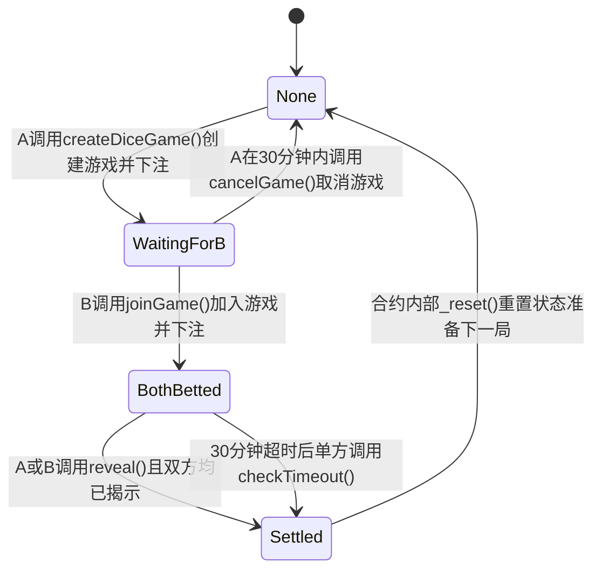

# Smart Contract Project Report: Token and Dice Game

## 1. Deployment Summary

*   **Token contract address (Sepolia)**: [在此处填入：Token合约地址]
*   **Dice contract address (Sepolia)**: [在此处填入：Dice合约地址]
*   **Tooling used**: [在此处填入：例如 Remix + Hardhat]
*   **Betting/Reward mechanism statement**: 玩家在游戏阶段通过质押 ETH 进行掷骰子对赌，游戏采用 Commit-Reveal 机制保证公平。胜者除了赢取合约内的全部 ETH 赌注外，还将额外获得由 Stage1 合约提供的 100 个固定代币奖励。若代币奖金池余额不足，则仅发放池中剩余数量的代币，保证不会因代币不足导致以太坊交易结算回滚。

## 2. Stage 1 Token: Design Notes

*   **Internal state variables**:
    *   `_locked`: `bool` 类型，用于防止重入攻击的互斥锁。
    *   `owner`: `address payable` 类型，记录合约的部署者与所有者。
    *   `PRICE_WEI_PER_TOKEN`: `uint128` 常量，固定为 600 wei，定义了每个代币的出售价格。
    *   `_totalSupply`: `uint256` 类型，记录当前代币的总供应量。
    *   `_name`, `_symbol`: `string` 类型，分别记录代币的名称和符号。
    *   `_balances`: `mapping(address => uint256)` 类型，记录每个地址的代币余额。
*   **Token acquisition path**: 
    *   **Minting**: 合约所有者（`owner`）可以通过调用 `mint(address to, uint256 value)` 函数直接为指定地址铸造代币。
*   **Sell mechanism**: 
    *   用户可调用 `sell(uint256 value)` 以固定汇率（600 wei/token）向合约出售代币并换取 ETH。
    *   出售后，对应的 `value` 会从用户的 `_balances` 减去，同时从 `_totalSupply` 中扣除（即从流通供应量中销毁）。
    *   最后通过 `call` 方法将计算得到的 `weiRequired` 发送给用户。
*   **Edge-case handling**: 
    *   **重入攻击**: 关键状态改变后使用 `call` 转账，同时函数使用了 `nonReentrant` 修饰器。
    *   **余额不足**: `transfer` 和 `sell` 操作时均要求 `require(_balances[msg.sender] >= value, "no enough balance")`。
    *   **流动性枯竭（合约内 ETH 不足）**: 在 `sell` 时检查 `require(address(this).balance >= weiRequired, "contract insufficient ETH")` 防止交易失败。

## 3. Stage 2 Dice Game: Protocol and State Machine

### State Machine Design


### State Transitions
*   **None**: 初始空闲状态。允许操作：玩家 A 调用 `createDiceGame` 下注。状态转换 -> `WaitingForB`。
*   **WaitingForB**: 等待玩家 B 加入。允许操作：玩家 B 调用 `joinGame` (状态转换 -> `BothBetted`)，或者玩家 A 调用 `cancelGame` 取消并退款 (状态转换 -> `None`)。
*   **BothBetted**: 双方已下注等待揭示阶段。允许操作：双方分别调用 `revealA`/`revealB` 揭示秘密值。当双方都揭示完毕或一方在 30 分钟后调用 `checkTimeout`，触发 `_diceGameSettle()` 结算。状态转换 -> `Settled`。
*   **Settled**: 结算状态。在 `_diceGameSettle()` 执行完毕后（给胜方发送 ETH 和 Token 奖励），合约立即内部调用 `_reset()`。状态转换 -> `None`。

### Randomness Approach
*   **Methodology**: Commit-Reveal 机制。玩家在下注时提交哈希承诺（`fingerPrint`），在揭示阶段提供原始秘密（`secret`）。最终伪随机种子由双方 `secret` 加上区块高度、时间戳、参与者地址联合哈希生成。
*   **Manipulation Resistance**: 由于哈希原像隐藏了初始输入，且最终随机数由双方输入共同决定（且结合了链上不可预测的区块数据），任何一方无法在提交阶段预测最终结果，从而无法进行单方面的确定性操控。

### Betting/Reward Mechanism Description
*   **What is bet (ETH, token, both)**: 仅以太坊（ETH）。
*   **When deposits happen**: 玩家 A 在调用 `createDiceGame` 时存入（`msg.value`），玩家 B 在调用 `joinGame` 时存入同等金额。
*   **Refund/forfeit conditions**: 
    *   **Refund**: 在 B 尚未加入前（即 `WaitingForB` 状态），A 可通过 `cancelGame` 主动取消游戏获得全额退款。
    *   **Forfeit**: 在揭示阶段（`BothBetted`），若一方超时 30 分钟未揭示秘密，已揭示的另一方可调用 `checkTimeout` 直接判胜，未揭示方的赌注将被没收归胜者所有。
*   **Solvency guarantee**: 智能合约强制要求玩家在加入游戏时发送 ETH 并锁定在合约中，胜者获取的是合约当前暂存的 `address(this).balance`，保证了结算时绝对有资金兑付。
*   **Token bonus pool funding & size determination**: Token 奖励池通过 Stage1 的合约进行管理，项目需预先将 Token 转移至 Stage2 合约地址下充当奖金池。每局游戏固定发给胜者 100 Token (`TOKEN_BONUS`)，若奖金池代币余额不足，则仅发送剩余的所有代币。

## 4. Security & Fairness Design

### Threat Model (威胁模型)
| Adversary | Description / Impact |
| :--- | :--- |
| **Malicious Player A/B** | 可能在揭示阶段发现自己会输而故意拒绝调用 `reveal` 以拖延结算锁定对方资金，或者在阶段一重复加入游戏试图刷取代币。 |
| **Miners / Front-runners** | 试图重排交易，或者在查看 mempool 中的 reveal 交易后尝试进行抢跑。但由于是 commit-reveal，抢跑 reveal 不会改变胜负。 |
| **Malicious Receiving Contract** | 作为赢家时（如果参与者是合约），故意在其 `receive()` 回退函数中 `revert`，拒绝接收 ETH 从而导致游戏结算失败。 |
| **Sybil Attackers** | 可能通过左右手互搏（自己与自己对赌）来消耗 Stage2 合约中的免费 Token 奖金池。 |

### Code-Level Hazards and Mitigations (代码级风险与缓解)
| Hazard | Mitigation |
| :--- | :--- |
| **Reentrancy (重入攻击)** | 合约引入了 `nonReentrant` 自定义防重入互斥锁修饰器；结算时使用 Checks-Effects-Interactions 模式（先改变状态 `_reset()`，再执行 `call{value}` 转账）。 |
| **DoS with revert (回滚导致的拒绝服务)** | 避免使用 `transfer()` 而是使用带返回值检查的 `call{value}("")`。这确保即使恶意合约拒绝接受 ETH，也能抛出明确异常，但需要注意该设计若没有额外提款机制，仍可能因恶意者导致游戏永远卡在结算（本项目目前的逻辑：如果接受方 revert，结算会被 block）。 |
| **Arithmetic Over/Underflow (算术溢出)** | 采用 Solidity 0.8.0 及以上版本，内置溢出检查保护。 |
| **Randomness from Block Attributes (区块变量伪随机性风险)** | 组合使用了 `block.number` 和 `block.timestamp` 并主要依赖双方强提供的私密 `secretA` 和 `secretB` 作为主要熵源。 |

### Mechanism-Level Hazards and Mitigations (机制级风险与缓解)
| Hazard | Mitigation |
| :--- | :--- |
| **Regret/abort prevention (防反悔/中止)** | 实现了 `checkTimeout` 超时惩罚机制，30分钟后如果一方不揭示，另一方可以强制执行并没收对方全额赌金。 |
| **Randomness manipulation (随机数操控)** | 采用双向 Commit-Reveal，只有在双方都提交后结果才确定。单方无法预知或改变随机数。 |
| **Token bonus pool abuse/drain risks (奖金池滥用/耗尽风险)** | 在代码中检查 `balanceOfStage1 >= TOKEN_BONUS`，在池子枯竭时不会 revert 而是下调奖励以保持系统运行。但目前尚未对单人游戏频率进行限制，具有一定的 Sybil 刷币风险。 |
| **Self-playing against bonus (自我对赌刷奖金)** | 代码通过 `require(msg.sender != gamblerA)` 禁止同一地址自对赌，增加了一点刷奖金的门槛（尽管攻击者仍可使用双地址）。 |
| **State logic deadlock (状态机死锁)** | 使用了明确的 `enum DiceGameState`，严格的转换验证（`WrongState` error），以及在结算后通过 `_reset()` 全面清理旧变量。 |
| **Uninitialized mapping/value issues (未初始化变量漏洞)** | 各个步骤中对提交的 `fingerPrint` 进行显式零值校验：`require(_fingerPrintForA != bytes32(0))`。 |

### Trade-offs (权衡取舍)
*   **安全性与公平性 vs 用户体验 (Gas与交互步骤)**: 为了实现 Commit-Reveal 防操控，要求用户交互两次（Commit一次，Reveal一次）。增加了一倍的 Gas 消耗以及等待交易确认的体验摩擦。
*   **推送支付 (Push) vs 拉取支付 (Pull)**: 当前使用推送支付在 `_diceGameSettle()` 阶段直接将资金推送给 `winner`。这在保证了用户快速收到钱的简单性体验时，承担了恶意合约可能通过 `revert` 卡住整个系统的微小风险。理想情况是让赢家自行拉取（withdraw）。

## 5. Gas and Fairness Evaluation

*   **Deployment Gas**: [在此处填入：列出 Stage 1 和 Stage 2 的部署 Gas 消耗]
*   **Typical Full Game Run Gas**: [在此处填入：列出主要路径的完整游戏 Gas 消耗，如 createGame + joinGame + revealA + revealB]
*   **Fairness Analysis**: 
    *   在正常游戏中，最后一个执行 `reveal` 的玩家，因为触发了 `_diceGameSettle()`，需要承担转账和奖励结算的全部额外 Gas 成本。这种非对称消耗在智能合约上普遍存在，一定程度上对最后一个 Reveal 的玩家不公平。

## 6. Test Evidence

*   **Full Game Execution Tx Hashes**: 
    *   [在此处填入：Tx Hash 1 - 描述]
    *   [在此处填入：Tx Hash 2 - 描述]
*   **Token Pool Evidence**: [在此处填入：提供代币池预充值和代币奖励转账的证据（如 Event logs 截图描述或余额变化）]

---

## Appendix A: Transaction History

| Step/Action | Contract | Transaction Hash | Brief Notes |
| :--- | :--- | :--- | :--- |
| [在此处填入：例如 Deploy Token] | [在此处填入：Token Name] | `[在此处填入：0x...]` | [在此处填入：部署代币合约] |
| [在此处填入：例如 Deploy Dice] | [在此处填入：Dice Name] | `[在此处填入：0x...]` | [在此处填入：部署骰子合约] |
| [在此处填入：交互步骤] | [在此处填入：相关合约] | `[在此处填入：0x...]` | [在此处填入：说明] |

## Appendix B: Source Code

```solidity
pragma solidity ^0.8.0;

contract Stage1{
    // 重入防护锁
    bool private _locked = false;
    
    // 重入防护修饰器
    modifier nonReentrant() {
        require(!_locked, "Reentrant call");
        _locked = true;
        _;
        _locked = false;
    }
    
    // state 
    address payable public owner;
    
    // events
    event Transfer(address indexed from, address indexed to, uint256 value);
    event Mint(address indexed to, uint256 value);
    event Sell(address indexed from, uint256 value);

    uint128 private constant PRICE_WEI_PER_TOKEN = 600;

    // contract internal state
    uint256 private _totalSupply;
    string private _name;
    string private _symbol;
    mapping(address => uint256) private _balances;

    // 构造函数
    constructor(string memory name, string memory symbol) {
        owner = payable(msg.sender);
        _name = name;
        _symbol = symbol;
    }

    // view functions 
    function getName() external view returns (string memory) {
        return _name;
    }

    function totalSupply() external view returns (uint256) {
        return _totalSupply;
    }

    function getSymbol() external view returns (string memory) {
        return _symbol;
    }

    function getPrice() external pure returns (uint128) {
        return PRICE_WEI_PER_TOKEN;
    }

    function balanceOf(address account) external view returns (uint256) {
        return _balances[account];
    }

    // State-Changing Functions
    function transfer(address to, uint256 value) external returns (bool) {
        require(to != address(0), "cannot transfer to 0x0");
        require(_balances[msg.sender] >= value, "no enough balance");

        _balances[msg.sender] -= value;
        _balances[to] += value;

        emit Transfer(msg.sender, to, value);
        return true;
    }

    function mint(address to, uint256 value) external returns (bool) {
        require(msg.sender == owner, "only owner may call");
        require(to != address(0), "mint to zero");

        _totalSupply += value;
        _balances[to] += value;
        emit Mint(to, value);

        return true;
    }     
    function sell(uint256 value) external nonReentrant returns (bool) {
        require(value > 0, "cannot sell zero or below");
        require(_balances[msg.sender] >= value, "no enough balance");

        uint256 weiRequired = uint256(PRICE_WEI_PER_TOKEN) * value;
        require(address(this).balance >= weiRequired, "contract insufficient ETH");

        _balances[msg.sender] -= value;
        _totalSupply -= value;

        emit Sell(msg.sender, value);

        (bool sent, ) = payable(msg.sender).call{value: weiRequired}("");
        require(sent, "ETH transfer failed");
        return true;
    }

    function close() external {
        require(msg.sender == owner, "only owner may call");
        selfdestruct(owner);
    }

    receive() external payable {}
}
```

```solidity
pragma solidity ^0.8.0;

interface IStage1 {
    function transfer(address to, uint256 value) external returns (bool);
    function balanceOf(address account) external view returns (uint256);
}

contract Stage2{
    bool private _locked = false;
    
    modifier nonReentrant() {
        require(!_locked, "Reentrant call");
        _locked = true;
        _;
        _locked = false;
    }
    
    enum DiceGameState { None, WaitingForB, BothBetted, Settled }
    DiceGameState public diceGameState;
    IStage1 public tokenContract;
    uint16 public constant TOKEN_BONUS = 100; 
    uint256 public constant TIMEOUT_DURATION = 30 * 60;

    event DiceGameCreated(address gamblerA, uint256 betAmount, bytes32 fingerPrintForA);
    event DiceGameJoined(address gamblerB, uint256 betAmount, bytes32 fingerPrintForB);
    event BetForARevealed();
    event BetForBRevealed();
    event DiceGameSettled(address winner, uint256 profits, uint256 stage1TokenBonus);

    address public gamblerA;
    bytes32 public fingerPrintForA;
    bytes32 public secretA;
    bool public revealedA;
    uint256 public betAmount;

    address public gamblerB;
    bytes32 public fingerPrintForB;
    bytes32 public secretB;
    bool public revealedB;

    address public winner;
    uint256 public gameCreatedAt;
    uint256 public gameJoinedAt;

    error WrongState(DiceGameState expected, DiceGameState actual);
    error InvalidParam(string message);
    error NotBetOwner(address caller, address expected);
    error RepeatedRevealed(address caller);
    error BetMismatch(bytes32 expected, bytes32 actual);

    constructor(address tokenContractAddress){
        require(tokenContractAddress != address(0), "invaild tokenContractAddress");
        tokenContract = IStage1(tokenContractAddress);
    }

    function createDiceGame(bytes32 _fingerPrintForA) external payable nonReentrant{
        if (diceGameState != DiceGameState.None) revert WrongState(DiceGameState.None, diceGameState);
        if (msg.value == 0) revert InvalidParam("bet amount must be greater than 0");
        if (_fingerPrintForA == bytes32(0)) revert InvalidParam("fingerprint cannot be zero");

        gamblerA = msg.sender;
        betAmount = msg.value;
        fingerPrintForA = _fingerPrintForA;
        revealedA = false;
        gameCreatedAt = block.timestamp;
        diceGameState = DiceGameState.WaitingForB;
        emit DiceGameCreated(gamblerA, betAmount, fingerPrintForA);
    }

    function joinGame(bytes32 _fingerPrintForB) external payable nonReentrant {
        if (diceGameState != DiceGameState.WaitingForB) revert WrongState(DiceGameState.WaitingForB, diceGameState);
        if (msg.sender == gamblerA) revert WrongState(DiceGameState.WaitingForB, diceGameState);
        if (msg.value != betAmount) revert InvalidParam("bet amount must match game bet amount");
        if (_fingerPrintForB == bytes32(0)) revert InvalidParam("fingerprint cannot be zero");
      
        gamblerB = msg.sender;
        fingerPrintForB = _fingerPrintForB;
        gameJoinedAt = block.timestamp;
        diceGameState = DiceGameState.BothBetted;

        emit DiceGameJoined(gamblerB, msg.value,fingerPrintForB);
    }

    function revealA(bytes32 _secretA) external nonReentrant {
        if (diceGameState != DiceGameState.BothBetted) revert WrongState(DiceGameState.BothBetted, diceGameState);
        if (msg.sender != gamblerA) revert NotBetOwner(msg.sender, gamblerA);
        if (revealedA) revert RepeatedRevealed(msg.sender);
        if (keccak256(abi.encodePacked(_secretA)) != fingerPrintForA) revert BetMismatch(fingerPrintForA, keccak256(abi.encodePacked(_secretA))); 
     
        secretA = _secretA;
        revealedA = true;
        emit BetForARevealed();
        if (revealedB) _diceGameSettle(); 
    }

    function revealB(bytes32 _secretB) external nonReentrant {
        if (diceGameState != DiceGameState.BothBetted) revert WrongState(DiceGameState.BothBetted, diceGameState);
        if (msg.sender != gamblerB) revert NotBetOwner(msg.sender, gamblerB);
        if (revealedB) revert RepeatedRevealed(msg.sender);
        if (keccak256(abi.encodePacked(_secretB)) != fingerPrintForB) revert BetMismatch(fingerPrintForB, keccak256(abi.encodePacked(_secretB))); 
     
        secretB = _secretB;
        revealedB = true;
        emit BetForBRevealed();
        if (revealedA) _diceGameSettle(); 
    }

    function _diceGameSettle() private nonReentrant{
        bytes32 randomSeed = keccak256(abi.encodePacked(
            secretA, secretB, block.number, block.timestamp, gamblerA, gamblerB
        ));
        uint256 n = (uint256(randomSeed) % 6) + 1;
        winner = n <= 3 ? gamblerA : gamblerB; 
        uint256 profits = address(this).balance; 
        uint256 balanceOfStage1 = tokenContract.balanceOf(address(this)); 
        uint256 stage1TokenBonus = balanceOfStage1 >= TOKEN_BONUS ? TOKEN_BONUS : balanceOfStage1;

        diceGameState = DiceGameState.Settled;
        emit DiceGameSettled(winner, profits, stage1TokenBonus);

        _reset(); 
        (bool sent, ) = payable(winner).call{value: profits}("");
        require(sent, "Bet profits failed to send");
        if (stage1TokenBonus > 0) {
            bool tokenSent = tokenContract.transfer(winner, stage1TokenBonus);
            require(tokenSent, "Stage1token bonus failed to send");
        }
    }

    function _reset() private {
        gamblerA = address(0);
        gamblerB = address(0);
        betAmount = 0;
        fingerPrintForA = bytes32(0);
        fingerPrintForB = bytes32(0);
        secretA = bytes32(0);
        secretB = bytes32(0);
        revealedA = false;
        revealedB = false;
        winner = address(0);
        gameCreatedAt = 0;
        gameJoinedAt = 0;
        diceGameState = DiceGameState.None;
    }

    receive() external payable {}

    function checkTimeout() external nonReentrant {
        if (diceGameState != DiceGameState.BothBetted) revert WrongState(DiceGameState.BothBetted, diceGameState);
        if (block.timestamp <= gameJoinedAt + TIMEOUT_DURATION) revert InvalidParam("game has not timed out yet");
        
        if (revealedA && !revealedB) {
            winner = gamblerA;
        } else if (revealedB && !revealedA) {
            winner = gamblerB;
        } else {
            revert InvalidParam("invalid timeout state: both revealed or none revealed");
        }
        
        uint256 profits = address(this).balance; 
        uint256 balanceOfStage1 = tokenContract.balanceOf(address(this)); 
        uint256 stage1TokenBonus = balanceOfStage1 >= TOKEN_BONUS ? TOKEN_BONUS : balanceOfStage1;

        diceGameState = DiceGameState.Settled;
        emit DiceGameSettled(winner, profits, stage1TokenBonus);

        _reset(); 
        (bool sent, ) = payable(winner).call{value: profits}("");
        require(sent, "Bet profits failed to send");
        if (stage1TokenBonus > 0) {
            bool tokenSent = tokenContract.transfer(winner, stage1TokenBonus);
            require(tokenSent, "Stage1token bonus failed to send");
        }
    }
    
    function getRemainingTimeout() external view returns (uint256) {
        if (diceGameState != DiceGameState.BothBetted) return 0;
        if (block.timestamp > gameJoinedAt + TIMEOUT_DURATION) return 0;
        return gameJoinedAt + TIMEOUT_DURATION - block.timestamp;
    }
    
    function cancelGame() external nonReentrant {
        if (diceGameState != DiceGameState.WaitingForB) revert WrongState(DiceGameState.WaitingForB, diceGameState);
        if (msg.sender != gamblerA) revert NotBetOwner(msg.sender, gamblerA);
        if (block.timestamp > gameCreatedAt + TIMEOUT_DURATION) revert InvalidParam("cancel period has expired");
        
        uint256 refundAmount = betAmount;
        _reset();
        
        (bool sent, ) = payable(msg.sender).call{value: refundAmount}("");
        require(sent, "Refund failed");
    }
    
    function getRemainingCancelTime() external view returns (uint256) {
        if (diceGameState != DiceGameState.WaitingForB) return 0;
        if (block.timestamp > gameCreatedAt + TIMEOUT_DURATION) return 0;
        return gameCreatedAt + TIMEOUT_DURATION - block.timestamp;
    }
}
```

## AI Usage Declaration

*   **Tools Used**: [在此处填入：使用的 AI 工具，如 ChatGPT, Claude 等]
*   **Scope of Use**: [在此处填入：AI 使用范围，例如 代码生成、安全审查、报告润色等]
*   **Verification**: [在此处填入：声明如何验证了 AI 生成的内容，例如 通过独立编写单元测试验证了生成的逻辑]

## Team Contribution Declaration

| Member Information | Member 1 | Member 2 |
| :--- | :--- | :--- |
| **Name** | [在此处填入] | [在此处填入或留空] |
| **Student ID** | [在此处填入] | [在此处填入或留空] |
| **Contribution Description** | [在此处填入具体写的合约、报告部分等] | [在此处填入或留空] |
| **Percentage of Effort** | [在此处填入]% | [在此处填入或留空]% |
| **Signature** | [在此处填入] | [在此处填入或留空] |

*By signing above, we declare that the work submitted is our own and that we have adhered to the academic integrity policies of the course.*
