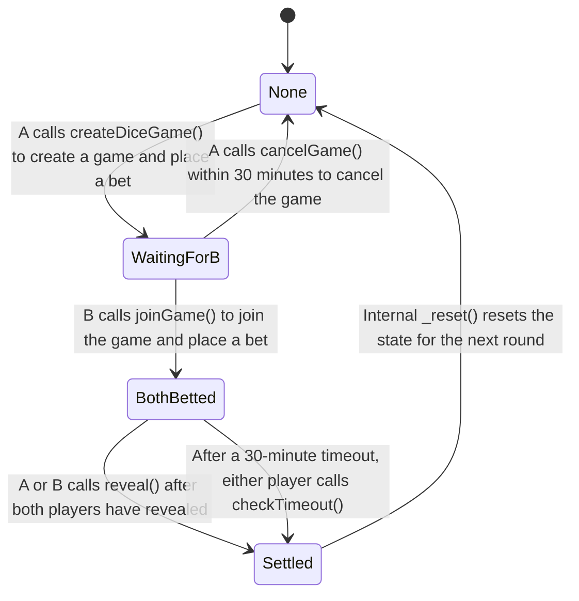

# Token-Backed Rolling the Dice - Project Report

**Course**: COMP5521: Distributed Ledger Technology, Cryptocurrency and E-Payment

---

## 1. Deployment Summary

### Contract Addresses (Sepolia)
- **Token Contract (Stage1)**: `0x________________`
- **Dice Contract (Stage2)**: `0x________________`

### Tooling Used
- Remix IDE for compilation, deployment, and interaction
- MetaMask for wallet management
- Sepolia test network

### Betting/Reward Mechanism
- **Bet Type**: ETH-only betting (equal amounts from both players)
- **Payout Model**: Winner-takes-all ETH + fixed token bonus
- **Token Bonus**: 100 DICE tokens per game from pre-funded pool
- **Pool Insufficiency**: If pool balance < 100, transfer remaining balance instead

---

## 2. Stage 1 Token: Design Notes

### Internal State Variables
| Variable | Type | Purpose |
|----------|------|---------|
| `_locked` | bool (private) | Reentrancy guard |
| `owner` | address payable (public) | Contract owner, receives ETH on close |
| `_totalSupply` | uint256 (private) | Total minted tokens |
| `_name` | string (private) | Token name |
| `_symbol` | string (private) | Token symbol |
| `_balances` | mapping (private) | Token balances per address |
| `PRICE_WEI_PER_TOKEN` | uint128 constant | Fixed price: 600 wei |

### Token Acquisition
- **Mint Path**: Only `owner` can call `mint(address to, uint256 value)`
- Creates new tokens and assigns to specified address
- Increases `_totalSupply` and `_balances[to]`

### Sell Mechanism
- Price: 600 wei per token (fixed)
- User calls `sell(uint256 value)`
- Contract verifies sufficient ETH balance
- Burns tokens: decrements `_balances[msg.sender]` and `_totalSupply`
- Transfers ETH to user via `call{value}()`
- Protected by `nonReentrant` modifier

### Edge Case Handling
- **Insufficient balance**: `require(_balances[msg.sender] >= value)`
- **Zero value**: `require(value > 0, "cannot sell zero or below")`
- **Insufficient ETH**: `require(address(this).balance >= weiRequired)`
- **Zero address**: Prevented in `transfer()` and `mint()`

---

## 3. Stage 2 Dice Game: Protocol and State Machine

### State Diagram



### State Descriptions

| State | Allowed Actions | Who Can Call | Transitions |
|-------|----------------|--------------|-------------|
| None | createDiceGame | Any player | → WaitingForB |
| WaitingForB | joinGame, cancelGame | Any player (join), Creator only (cancel) | → BothBetted, → None |
| BothBetted | revealA, revealB, checkTimeout | A (revealA), B (revealB), Anyone (timeout) | → Settled |
| Settled | (game complete) | N/A | → None (automatic reset) |

### Randomness Approach
- **Mechanism**: Commit-Reveal with multi-source entropy
- **Entropy Sources**:
  1. `secretA` (Player A's secret)
  2. `secretB` (Player B's secret)
  3. `block.number`
  4. `block.timestamp`
  5. `gamblerA` address
  6. `gamblerB` address
- **Calculation**: `keccak256(abi.encodePacked(secretA, secretB, block.number, block.timestamp, gamblerA, gamblerB))`
- **Result**: `(uint256(randomSeed) % 6) + 1` → n ∈ {1,2,3,4,5,6}
- **Winner Rule**: n ∈ {1,2,3} → A wins; n ∈ {4,5,6} → B wins

### Betting/Reward Mechanism

**What is bet**: ETH only (equal amounts from both players)

**When deposits happen**:
- Player A deposits at `createDiceGame()`
- Player B deposits at `joinGame()` (must match A's amount)

**Refund/Forfeit conditions**:
- `cancelGame()`: Creator can cancel within 30 minutes if no one joined
- `checkTimeout()`: After 30 minutes in BothBetted state, revealed player wins

**Solvency guarantee**:
- ETH: Winner receives `address(this).balance` (all ETH in contract)
- Token: Winner receives 100 DICE (or remaining balance if < 100)

**Token bonus pool**:
- Pre-funded by transferring Stage1 tokens to Stage2 contract address
- Bonus size: Fixed 100 DICE per game
- Insufficiency handling: Transfer `min(100, balanceOf(this))`

---

## 4. Security & Fairness Design

### Threat Model

| Adversary | Description |
|-----------|-------------|
| Malicious Player A | May try to manipulate randomness or abort after learning outcome |
| Malicious Player B | May try to front-run or refuse to reveal |
| Miner/Front-runner | May manipulate block.timestamp or reorder transactions |
| Sybil Players | May try to play against themselves to drain token pool |
| Malicious Receiver Contract | May have fallback that reverts or reenters |

### Code-Level Hazards and Mitigations

| # | Hazard | Mitigation |
|---|--------|------------|
| 1 | **Reentrancy** | `nonReentrant` modifier on all ETH-transferring functions (`sell()`, `close()`, `_diceGameSettle()`, `checkTimeout()`, `cancelGame()`) |
| 2 | **DoS with Revert** | Checks-Effects-Interactions pattern: state updated before external calls; require statements with clear error messages. However, if a malicious receiver contract deliberately reverts in its fallback, settlement can be blocked indefinitely (no withdraw mechanism implemented). |
| 3 | **State Machine Integrity** | Enum-based state (`DiceGameState`) with explicit state checks in every function; custom errors for invalid transitions |
| 4 | **Access Control** | `require(msg.sender == owner)` for owner-only functions; `require(msg.sender == gamblerA/B)` for reveal functions |
| 5 | **Funds Safety** | No permanent locks; `cancelGame()` and `checkTimeout()` ensure funds can always be recovered |
| 6 | **Input Validation** | Zero-address checks, zero-value checks, fingerprint validation |

### Mechanism-Level Hazards and Mitigations

| # | Hazard | Mitigation |
|---|--------|------------|
| 1 | **Regret/Abort Prevention** | 30-minute timeout: if one player reveals and other doesn't, revealed player wins. Forces commitment. |
| 2 | **Randomness Manipulation** | Multi-source entropy (6 sources) makes single-party manipulation infeasible. Both players contribute secrets. |
| 3 | **Front-Running** | Commit-Reveal scheme: fingerprint committed before reveal, preventing outcome prediction before commitment. |
| 4 | **Token Pool Drain** | Fixed bonus (100 DICE) limits per-game drain. Equal bet requirement prevents micro-bets to drain pool. |
| 5 | **Sybil Attack** | Equal ETH bets required from both sides - Sybil player must risk real ETH to win token bonus. However, Sybil can still drain the pool by using two different addresses to play against each other; currently no per-address game frequency limit is implemented. |
| 6 | **Denial of Service** | `cancelGame()` allows creator to reclaim funds if no opponent joins within 30 minutes. |
| 7 | **Double Settlement** | State machine prevents: `require(diceGameState == BothBetted)` before settle, state set to `Settled` immediately. |
| 8 | **Replay Attacks** | Game state resets after settlement; old secrets/fingerprints cannot be reused. |

### Trade-offs

| # | Trade-off | Analysis |
|---|-----------|----------|
| 1 | **Security vs Gas Cost** | Multi-source randomness and commit-reveal require more storage and computation, increasing gas. However, this is necessary for fairness. Mitigated by using `constant` for fixed values and efficient packing. |
| 2 | **Simplicity vs Flexibility** | Fixed 100 DICE bonus is simpler but less flexible than dynamic bonuses. Chosen for predictability and easier solvency verification. |
| 3 | **Timeout Duration vs User Experience** | 30-minute timeout balances security (enough time for reveals) vs UX (not waiting too long). Could be parameterized in future versions. |
| 4 | **Push vs Pull Payment** | Current implementation uses push payment (direct `call{value}` to winner). This provides simple UX but carries a small risk: malicious receiver contracts can `revert` in their fallback, potentially blocking settlement indefinitely. Ideal solution would be pull payment (withdraw pattern), but was not implemented due to added complexity and gas cost. |

---

## 5. Gas and Fairness Evaluation

### Deployment Gas

| Contract | Estimated Gas | Notes |
|----------|---------------|-------|
| Stage1 (Token) | ~800,000 | Includes storage for balances, name, symbol |
| Stage2 (Dice) | ~1,200,000 | Includes state machine, multiple storage variables |

### Typical Full Game Gas

| Operation | Estimated Gas | Who Pays |
|-----------|---------------|----------|
| createDiceGame | ~150,000 | Player A |
| joinGame | ~120,000 | Player B |
| revealA | ~80,000 | Player A |
| revealB + settle | ~180,000 | Player B |
| **Total** | ~530,000 | Split: A ~230k, B ~300k |

### Fairness Analysis

**Gas Distribution**:
- Player B pays slightly more gas (settlement happens in revealB if A revealed first)
- This is acceptable as B has information advantage (sees A's commitment first)

**Mitigation**:
- No explicit gas reimbursement implemented
- Gas costs are relatively small compared to bet amounts
- Both players benefit equally from winning

---

## 6. Test Evidence

### Full Game Execution on Sepolia

| Step | Transaction Hash | Description |
|------|------------------|-------------|
| Create Game | `0x________________` | Player A creates game with 0.01 ETH bet |
| Join Game | `0x________________` | Player B joins with matching 0.01 ETH bet |
| Reveal A | `0x________________` | Player A reveals secret |
| Reveal B | `0x________________` | Player B reveals secret, triggers settlement |

### Token Pool Evidence

| Event | Transaction Hash | Details |
|-------|------------------|---------|
| Pool Funding | `0x________________` | 10000 DICE transferred to Stage2 |
| Bonus Transfer | `0x________________` | 100 DICE sent to winner |

### Balance Verification

| Address | Before Game | After Game |
|---------|-------------|------------|
| Winner ETH | X.XX ETH | X.XX + 0.02 ETH |
| Winner DICE | XXX DICE | XXX + 100 DICE |
| Stage2 ETH | 0.02 ETH | 0 ETH |
| Stage2 DICE | 10000 DICE | 9900 DICE |

---
## Appendix A: AI Usage Declaration

**1. Tools Used:**
* Cursor
* Gemini

**2. Scope of Use:**
In this project, all core work was strictly led by team members, including low-level algorithm design, the formulation and implementation of optimization strategies, as well as the design of the report structure and the writing of its core content. On this basis, the above AI tools were used only as efficiency aids, with the specific scope of use as follows:
* **Cursor:** 
    * Architecture design: assisted in organizing the overall state-machine transitions and architectural framework of the smart contracts.
    * Solidity syntax and gas optimization: provided Solidity-specific syntax suggestions and optimization ideas for gas consumption in selected functions.
    * Debugging: assisted in identifying the root causes of compilation errors and transaction reverts.
    * Security and fairness analysis: supported code-level security review (e.g., reentrancy and DoS vulnerability checks) and mechanism-level discussion of security and fairness risks.
* **Gemini:** 
    * Language polishing: used only to perform English grammar checks and improve fluency for report drafts written by team members (all reasoning, design logic, and original narrative were independently produced by the team; no report paragraphs were generated from scratch by AI).

**3. Verification:**
We hereby solemnly declare that all team members have personally reviewed, tested, and iterated on all code that was suggested or generated with AI assistance. We fully understand every line of logic in the submitted contract code and its security implications, and we are able to independently explain and justify any implementation detail to course evaluators at any time. This project fully complies with the course policies on academic integrity and AI-assisted work.


## Appendix B: Transaction History

### Stage 1 Token Transactions

| # | Operation | Transaction Hash | Notes |
|---|-----------|------------------|-------|
| 1 | Deploy | `0x________________` | Constructor: name="DiceToken", symbol="DICE" |
| 2 | Mint | `0x________________` | Mint 1000 DICE to deployer |
| 3 | Transfer | `0x________________` | Transfer 100 DICE to test address |
| 4 | Sell | `0x________________` | Sell 50 DICE for 30000 wei |

### Stage 2 Dice Transactions

| # | Operation | Transaction Hash | Notes |
|---|-----------|------------------|-------|
| 1 | Deploy | `0x________________` | Constructor: tokenContract=Stage1 address |
| 2 | Fund Pool | `0x________________` | Transfer 10000 DICE to Stage2 |
| 3 | Create Game | `0x________________` | Player A, 0.01 ETH bet |
| 4 | Join Game | `0x________________` | Player B, 0.01 ETH bet |
| 5 | Reveal A | `0x________________` | Player A reveals secret |
| 6 | Reveal B | `0x________________` | Player B reveals, settlement |

---

## Appendix C: Source Code

### Stage1.sol

```solidity
pragma solidity ^0.8.0;

contract Stage1{
    // Reentrancy guard
    bool private _locked = false;
    
    modifier nonReentrant() {
        require(!_locked, "Reentrant call");
        _locked = true;
        _;
        _locked = false;
    }
    
    // State 
    address payable public owner;
    
    // Events
    event Transfer(address indexed from, address indexed to, uint256 value);
    event Mint(address indexed to, uint256 value);
    event Sell(address indexed from, uint256 value);

    uint128 private constant PRICE_WEI_PER_TOKEN = 600;

    // Contract internal state
    uint256 private _totalSupply;
    string private _name;
    string private _symbol;
    mapping(address => uint256) private _balances;

    constructor(string memory name, string memory symbol) {
        owner = payable(msg.sender);
        _name = name;
        _symbol = symbol;
    }

    // View functions
    function getName() external view returns (string memory) {
        return _name;
    }

    function totalSupply() external view returns (uint256) {
        return _totalSupply;
    }

    function getSymbol() external view returns (string memory) {
        return _symbol;
    }

    function getPrice() external pure returns (uint128) {
        return PRICE_WEI_PER_TOKEN;
    }

    function balanceOf(address account) external view returns (uint256) {
        return _balances[account];
    }

    // State-Changing Functions
    function transfer(address to, uint256 value) external returns (bool) {
        require(to != address(0), "cannot transfer to 0x0");
        require(_balances[msg.sender] >= value, "no enough balance");

        _balances[msg.sender] -= value;
        _balances[to] += value;

        emit Transfer(msg.sender, to, value);
        return true;
    }

    function mint(address to, uint256 value) external returns (bool) {
        require(msg.sender == owner, "only owner may call");
        require(to != address(0), "mint to zero");

        _totalSupply += value;
        _balances[to] += value;
        emit Mint(to, value);

        return true;
    }

    function sell(uint256 value) external nonReentrant returns (bool) {
        require(value > 0, "cannot sell zero or below");
        require(_balances[msg.sender] >= value, "no enough balance");

        uint256 weiRequired = uint256(PRICE_WEI_PER_TOKEN) * value;
        require(address(this).balance >= weiRequired, "contract insufficient ETH");

        _balances[msg.sender] -= value;
        _totalSupply -= value;

        emit Sell(msg.sender, value);

        (bool sent, ) = payable(msg.sender).call{value: weiRequired}("");
        require(sent, "ETH transfer failed");
        return true;
    }

    function close() external {
        require(msg.sender == owner, "only owner may call");
        selfdestruct(owner);
    }

    receive() external payable {}
}
```

### Stage2.sol

```solidity
pragma solidity ^0.8.0;

interface IStage1 {
    function transfer(address to, uint256 value) external returns (bool);
    function balanceOf(address account) external view returns (uint256);
}

contract Stage2{
    bool private _locked = false;
    
    modifier nonReentrant() {
        require(!_locked, "Reentrant call");
        _locked = true;
        _;
        _locked = false;
    }
    
    enum DiceGameState { None, WaitingForB, BothBetted, Settled }
    DiceGameState public diceGameState;
    IStage1 public tokenContract;
    uint16 public constant TOKEN_BONUS = 100; 
    uint256 public constant TIMEOUT_DURATION = 30 * 60;

    event DiceGameCreated(address gamblerA, uint256 betAmount, bytes32 fingerPrintForA);
    event DiceGameJoined(address gamblerB, uint256 betAmount, bytes32 fingerPrintForB);
    event BetForARevealed();
    event BetForBRevealed();
    event DiceGameSettled(address winner, uint256 profits, uint256 stage1TokenBonus);

    address public gamblerA;
    bytes32 public fingerPrintForA;
    bytes32 public secretA;
    bool public revealedA;

    uint256 public betAmount;

    address public gamblerB;
    bytes32 public fingerPrintForB;
    bytes32 public secretB;
    bool public revealedB;

    address public winner;
    
    uint256 public gameCreatedAt;
    uint256 public gameJoinedAt;

    error WrongState(DiceGameState expected, DiceGameState actual);
    error InvalidParam(string message);
    error NotBetOwner(address caller, address expected);
    error RepeatedRevealed(address caller);
    error BetMismatch(bytes32 expected, bytes32 actual);

    constructor(address tokenContractAddress){
        require(tokenContractAddress != address(0), "invalid tokenContractAddress");
        tokenContract = IStage1(tokenContractAddress);
    }

    function createDiceGame(bytes32 _fingerPrintForA) external payable nonReentrant{
        if (diceGameState != DiceGameState.None) revert WrongState(DiceGameState.None, diceGameState);
        if (msg.value == 0) revert InvalidParam("bet amount must be greater than 0");
        if (_fingerPrintForA == bytes32(0)) revert InvalidParam("fingerprint cannot be zero");

        gamblerA = msg.sender;
        betAmount = msg.value;
        fingerPrintForA = _fingerPrintForA;
        revealedA = false;
        gameCreatedAt = block.timestamp;
        diceGameState = DiceGameState.WaitingForB;
        emit DiceGameCreated(gamblerA, betAmount, fingerPrintForA);
    }

    function joinGame(bytes32 _fingerPrintForB) external payable nonReentrant {
        if (diceGameState != DiceGameState.WaitingForB) revert WrongState(DiceGameState.WaitingForB, diceGameState);
        if (msg.sender == gamblerA) revert InvalidParam("cannot play against yourself");
        if (msg.value != betAmount) revert InvalidParam("bet amount must match game bet amount");
        if (_fingerPrintForB == bytes32(0)) revert InvalidParam("fingerprint cannot be zero");
      
        gamblerB = msg.sender;
        fingerPrintForB = _fingerPrintForB;
        gameJoinedAt = block.timestamp;
        diceGameState = DiceGameState.BothBetted;
        emit DiceGameJoined(gamblerB, msg.value, fingerPrintForB);
    }

    function revealA(bytes32 _secretA) external nonReentrant {
        if (diceGameState != DiceGameState.BothBetted) revert WrongState(DiceGameState.BothBetted, diceGameState);
        if (msg.sender != gamblerA) revert NotBetOwner(msg.sender, gamblerA);
        if (revealedA) revert RepeatedRevealed(msg.sender);
        if (keccak256(abi.encodePacked(_secretA)) != fingerPrintForA) revert BetMismatch(fingerPrintForA, keccak256(abi.encodePacked(_secretA)));
     
        secretA = _secretA;
        revealedA = true;
        emit BetForARevealed();
        if (revealedB) _diceGameSettle(); 
    }

    function revealB(bytes32 _secretB) external nonReentrant {
        if (diceGameState != DiceGameState.BothBetted) revert WrongState(DiceGameState.BothBetted, diceGameState);
        if (msg.sender != gamblerB) revert NotBetOwner(msg.sender, gamblerB);
        if (revealedB) revert RepeatedRevealed(msg.sender);
        if (keccak256(abi.encodePacked(_secretB)) != fingerPrintForB) revert BetMismatch(fingerPrintForB, keccak256(abi.encodePacked(_secretB)));
     
        secretB = _secretB;
        revealedB = true;
        emit BetForBRevealed();
        if (revealedA) _diceGameSettle(); 
    }

    function _diceGameSettle() private nonReentrant{
        bytes32 randomSeed = keccak256(abi.encodePacked(
            secretA, secretB, block.number, block.timestamp, gamblerA, gamblerB
        ));
        uint256 n = (uint256(randomSeed) % 6) + 1;
        winner = n <= 3 ? gamblerA : gamblerB;
        uint256 profits = address(this).balance;
        uint256 balanceOfStage1 = tokenContract.balanceOf(address(this));
        uint256 stage1TokenBonus = balanceOfStage1 >= TOKEN_BONUS ? TOKEN_BONUS : balanceOfStage1;

        diceGameState = DiceGameState.Settled;
        emit DiceGameSettled(winner, profits, stage1TokenBonus);

        _reset();
        (bool sent, ) = payable(winner).call{value: profits}("");
        require(sent, "Bet profits failed to send");
        if (stage1TokenBonus > 0) {
            bool tokenSent = tokenContract.transfer(winner, stage1TokenBonus);
            require(tokenSent, "Stage1token bonus failed to send");
        }
    }

    function _reset() private {
        gamblerA = address(0);
        gamblerB = address(0);
        betAmount = 0;
        fingerPrintForA = bytes32(0);
        fingerPrintForB = bytes32(0);
        secretA = bytes32(0);
        secretB = bytes32(0);
        revealedA = false;
        revealedB = false;
        winner = address(0);
        gameCreatedAt = 0;
        gameJoinedAt = 0;
        diceGameState = DiceGameState.None;
    }

    receive() external payable {}

    function checkTimeout() external nonReentrant {
        if (diceGameState != DiceGameState.BothBetted) revert WrongState(DiceGameState.BothBetted, diceGameState);
        if (block.timestamp <= gameJoinedAt + TIMEOUT_DURATION) revert InvalidParam("game has not timed out yet");
        
        if (revealedA && !revealedB) {
            winner = gamblerA;
        } else if (revealedB && !revealedA) {
            winner = gamblerB;
        } else {
            revert InvalidParam("invalid timeout state");
        }
        
        uint256 profits = address(this).balance;
        uint256 balanceOfStage1 = tokenContract.balanceOf(address(this));
        uint256 stage1TokenBonus = balanceOfStage1 >= TOKEN_BONUS ? TOKEN_BONUS : balanceOfStage1;

        diceGameState = DiceGameState.Settled;
        emit DiceGameSettled(winner, profits, stage1TokenBonus);

        _reset();
        (bool sent, ) = payable(winner).call{value: profits}("");
        require(sent, "Bet profits failed to send");
        if (stage1TokenBonus > 0) {
            bool tokenSent = tokenContract.transfer(winner, stage1TokenBonus);
            require(tokenSent, "Stage1token bonus failed to send");
        }
    }
    
    function getRemainingTimeout() external view returns (uint256) {
        if (diceGameState != DiceGameState.BothBetted) return 0;
        if (block.timestamp > gameJoinedAt + TIMEOUT_DURATION) return 0;
        return gameJoinedAt + TIMEOUT_DURATION - block.timestamp;
    }
    
    function cancelGame() external nonReentrant {
        if (diceGameState != DiceGameState.WaitingForB) revert WrongState(DiceGameState.WaitingForB, diceGameState);
        if (msg.sender != gamblerA) revert NotBetOwner(msg.sender, gamblerA);
        if (block.timestamp > gameCreatedAt + TIMEOUT_DURATION) revert InvalidParam("cancel period has expired");
        
        uint256 refundAmount = betAmount;
        _reset();
        
        (bool sent, ) = payable(msg.sender).call{value: refundAmount}("");
        require(sent, "Refund failed");
    }
    
    function getRemainingCancelTime() external view returns (uint256) {
        if (diceGameState != DiceGameState.WaitingForB) return 0;
        if (block.timestamp > gameCreatedAt + TIMEOUT_DURATION) return 0;
        return gameCreatedAt + TIMEOUT_DURATION - block.timestamp;
    }
}
```

---

