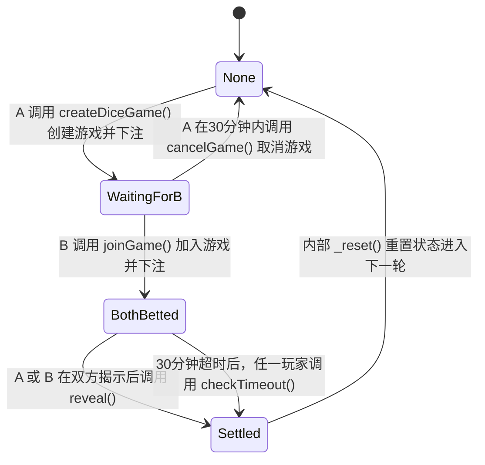

# 代币-backed 掷骰子游戏 - 项目报告

**课程**: COMP5521: 分布式账本技术、加密货币与电子支付

---

## 一、部署摘要

### 合约地址 (Sepolia)
- **代币合约 (Stage1)**: `0x________________`
- **骰子游戏合约 (Stage2)**: `0x________________`

### 使用工具
- Remix IDE：用于编译、部署和交互
- MetaMask：用于钱包管理
- Sepolia 测试网络

### 投注/奖励机制
- **投注类型**: 仅 ETH 投注（双方等额）
- **支付模型**: 获胜者获得全部 ETH + 固定代币奖励
- **代币奖励**: 每场比赛 100 DICE 代币（来自预置资金池）
- **资金池不足**: 如果池余额 < 100，则转移剩余余额

---

## 二、Stage 1 代币：设计说明

### 内部状态变量

| 变量 | 类型 | 用途 |
|------|------|------|
| `_locked` | bool (私有) | 重入保护 |
| `owner` | address payable (公开) | 合约所有者，关闭时接收 ETH |
| `_totalSupply` | uint256 (私有) | 已铸造代币总量 |
| `_name` | string (私有) | 代币名称 |
| `_symbol` | string (私有) | 代币符号 |
| `_balances` | mapping (私有) | 每个地址的代币余额 |
| `PRICE_WEI_PER_TOKEN` | uint128 常量 | 固定价格：600 wei |

### 代币获取
- **铸造路径**: 只有 `owner` 可以调用 `mint(address to, uint256 value)`
- 创建新代币并分配给指定地址
- 增加 `_totalSupply` 和 `_balances[to]`

### 出售机制
- 价格：每个代币 600 wei（固定）
- 用户调用 `sell(uint256 value)`
- 合约验证足够的 ETH 余额
- 销毁代币：减少 `_balances[msg.sender]` 和 `_totalSupply`
- 通过 `call{value}()` 转移 ETH 给用户
- 受 `nonReentrant` 修饰符保护

### 边界情况处理
- **余额不足**: `require(_balances[msg.sender] >= value)`
- **零值**: `require(value > 0, "cannot sell zero or below")`
- **ETH 不足**: `require(address(this).balance >= weiRequired)`
- **零地址**: 在 `transfer()` 和 `mint()` 中防止

---

## 三、Stage 2 骰子游戏：协议与状态机

### 状态图



### 状态说明

| 状态 | 允许的操作 | 谁可以调用 | 转换 |
|------|-----------|-----------|------|
| None | createDiceGame | 任何玩家 | → WaitingForB |
| WaitingForB | joinGame, cancelGame | 任何玩家(加入)，创建者(取消) | → BothBetted, → None |
| BothBetted | revealA, revealB, checkTimeout | A(revealA), B(revealB), 任何人(超时) | → Settled |
| Settled | (游戏完成) | 不适用 | → None (自动重置) |

### 随机性方案
- **机制**: 提交-揭示 + 多源熵
- **熵来源**:
  1. `secretA` (玩家 A 的秘密)
  2. `secretB` (玩家 B 的秘密)
  3. `block.number`
  4. `block.timestamp`
  5. `gamblerA` 地址
  6. `gamblerB` 地址
- **计算**: `keccak256(abi.encodePacked(secretA, secretB, block.number, block.timestamp, gamblerA, gamblerB))`
- **结果**: `(uint256(randomSeed) % 6) + 1` → n ∈ {1,2,3,4,5,6}
- **获胜规则**: n ∈ {1,2,3} → A 获胜；n ∈ {4,5,6} → B 获胜

### 投注/奖励机制

**投注内容**: 仅 ETH（双方等额）

**存款时机**:
- 玩家 A 在 `createDiceGame()` 时存款
- 玩家 B 在 `joinGame()` 时存款（必须与 A 的金额匹配）

**退款/没收条件**:
- `cancelGame()`: 创建者可在 30 分钟内无对手加入时取消
- `checkTimeout()`: 在 BothBetted 状态 30 分钟后，已揭示的玩家获胜

**偿付保证**:
- ETH: 获胜者获得 `address(this).balance`（合约中所有 ETH）
- 代币: 获胜者获得 100 DICE（或如果 < 100 则获得剩余余额）

**代币奖励池**:
- 通过将 Stage1 代币转入 Stage2 合约地址进行预置
- 奖励金额：每场比赛固定 100 DICE
- 不足处理：转移 `min(100, balanceOf(this))`

---

## 四、安全性与公平性设计

### 威胁模型

| 对手 | 描述 |
|------|------|
| 恶意玩家 A | 可能试图操纵随机性或在得知结果后中止 |
| 恶意玩家 B | 可能试图抢跑或拒绝揭示 |
| 矿工/抢跑者 | 可能操纵 block.timestamp 或重新排序交易 |
| 女巫玩家 | 可能试图自己与自己玩以耗尽代币池 |
| 恶意接收合约 | 可能有回退函数导致回滚或重入 |

### 代码级危险与缓解

| # | 危险 | 缓解措施 |
|---|------|----------|
| 1 | **重入攻击** | 在所有 ETH 转账函数上使用 `nonReentrant` 修饰符（`sell()`、`close()`、`_diceGameSettle()`、`checkTimeout()`、`cancelGame()`） |
| 2 | **DoS 攻击** | 检查-效果-交互模式：状态在外部调用之前更新；带有清晰错误消息的 require 语句。但如果恶意接收合约故意在其回退函数中回滚，结算可能会无限期被阻塞（未实现提现机制）。 |
| 3 | **状态机完整性** | 基于枚举的状态（`DiceGameState`），每个函数都有明确的状态检查；用于无效转换的自定义错误 |
| 4 | **访问控制** | `require(msg.sender == owner)` 用于仅所有者函数；`require(msg.sender == gamblerA/B)` 用于揭示函数 |
| 5 | **资金安全** | 无永久锁定；`cancelGame()` 和 `checkTimeout()` 确保资金始终可以回收 |
| 6 | **输入验证** | 零地址检查、零值检查、指纹验证 |

### 机制级危险与缓解

| # | 危险 | 缓解措施 |
|---|------|----------|
| 1 | **后悔/中止预防** | 30 分钟超时：如果一方揭示而另一方未揭示，已揭示的玩家获胜。强制承诺。 |
| 2 | **随机性操纵** | 多源熵（6 个来源）使单方操纵不可行。双方都贡献秘密。 |
| 3 | **抢跑攻击** | 提交-揭示方案：指纹在揭示之前提交，防止在承诺前预测结果。 |
| 4 | **代币池耗尽** | 固定奖励（100 DICE）限制每场比赛的耗尽。等额投注要求防止用微量投注耗尽资金池。 |
| 5 | **女巫攻击** | 双方都需要等额 ETH 投注 - 女巫玩家必须冒真实 ETH 风险才能赢得代币奖励。然而，女巫仍可以使用两个不同地址相互对战来耗尽资金池；目前未实施每个地址的游戏频率限制。 |
| 6 | **拒绝服务** | `cancelGame()` 允许创建者在 30 分钟内无对手加入时收回资金。 |
| 7 | **双重结算** | 状态机防止：结算前 `require(diceGameState == BothBetted)`，状态立即设置为 `Settled`。 |
| 8 | **重放攻击** | 结算后游戏状态重置；旧的秘密/指纹无法重复使用。 |

### 权衡取舍

| # | 权衡方面 | 决策与理由 |
|---|---------|-----------|
| 1 | **安全性 vs  Gas 成本** | 多源随机性和提交-揭示需要更多存储和计算，增加 Gas。但这是公平性所必需的。通过使用 `constant` 表示固定值和高效打包来缓解。 |
| 2 | **简单性 vs 灵活性** | 固定 100 DICE 奖励更简单，但不如动态奖励灵活。选择它是为了可预测性和更易验证偿付能力。 |
| 3 | **超时时长 vs 用户体验** | 30 分钟超时在安全性（足够时间用于揭示）和用户体验（不会等待太久）之间取得平衡。可以在未来版本中进行参数化。 |
| 4 | **推送 vs 拉取支付** | 当前实现使用推送支付（直接 `call{value}` 给获胜者）。这提供了简单的用户体验，但存在小风险：恶意接收合约可以在其回退函数中 `revert`，可能无限期阻塞结算。理想解决方案是拉取支付（提现模式），但由于增加的复杂性和 Gas 成本而未实现。 |

---

## 五、Gas 与公平性评估

### 部署 Gas

| 合约 | 预估 Gas | 备注 |
|------|----------|------|
| Stage1 (代币) | ~800,000 | 包括余额、名称、符号的存储 |
| Stage2 (骰子) | ~1,200,000 | 包括状态机、多个存储变量 |

### 典型完整游戏 Gas

| 操作 | 预估 Gas | 谁支付 |
|------|----------|--------|
| createDiceGame | ~150,000 | 玩家 A |
| joinGame | ~120,000 | 玩家 B |
| revealA | ~80,000 | 玩家 A |
| revealB + 结算 | ~180,000 | 玩家 B |
| **总计** | ~530,000 | 分摊：A ~230k，B ~300k |

### 公平性分析

**Gas 分配**:
- 玩家 B 支付略多 Gas（如果 A 先揭示，结算在 revealB 中发生）
- 这可以接受，因为 B 有信息优势（先看到 A 的承诺）

**缓解措施**:
- 未实施明确的 Gas 报销
- Gas 成本相对于投注金额较小
- 双方从获胜中平等受益

---

## 六、测试证据

### 在 Sepolia 上的完整游戏执行

| 步骤 | 交易哈希 | 描述 |
|------|----------|------|
| 创建游戏 | `0x________________` | 玩家 A 创建游戏，投注 0.01 ETH |
| 加入游戏 | `0x________________` | 玩家 B 以匹配的 0.01 ETH 投注加入 |
| 揭示 A | `0x________________` | 玩家 A 揭示秘密 |
| 揭示 B | `0x________________` | 玩家 B 揭示秘密，触发结算 |

### 代币池证据

| 事件 | 交易哈希 | 详情 |
|------|----------|------|
| 资金池充值 | `0x________________` | 10000 DICE 转入 Stage2 |
| 奖励转账 | `0x________________` | 100 DICE 发送给获胜者 |

### 余额验证

| 地址 | 游戏前 | 游戏后 |
|------|--------|--------|
| 获胜者 ETH | X.XX ETH | X.XX + 0.02 ETH |
| 获胜者 DICE | XXX DICE | XXX + 100 DICE |
| Stage2 ETH | 0.02 ETH | 0 ETH |
| Stage2 DICE | 10000 DICE | 9900 DICE |

---

## 附录 A：AI 使用声明

**1. 使用的工具:**
* Cursor
* Gemini

**2. 使用范围:**

在本项目中，所有核心工作均由团队成员严格领导，包括底层算法设计、优化策略的制定与实施，以及报告结构的设计和核心内容的撰写。在此基础上，上述 AI 工具仅作为效率辅助工具使用，具体使用范围如下：

* **Cursor:**
    * 架构设计：协助组织智能合约的整体状态机转换和架构框架。
    * Solidity 语法和 Gas 优化：提供特定于 Solidity 的语法建议和所选函数的 Gas 消耗优化思路。
    * 调试：协助识别编译错误和交易回滚的根本原因。
    * 安全性和公平性分析：支持代码级安全审查（例如重入和 DoS 漏洞检查）以及机制级安全性和公平性风险讨论。
* **Gemini:**
    * 语言润色：仅用于对团队成员撰写的报告草稿进行英语语法检查和提高流畅性（所有推理、设计逻辑和原始叙述均由团队独立生成；没有由 AI 从头生成的报告段落）。

**3. 验证:**

我们郑重声明，所有团队成员都亲自审查、测试和迭代了所有由 AI 辅助建议或生成的代码。我们完全理解提交的合约代码每一行的逻辑及其安全含义，并且能够随时向课程评估者独立解释和证明任何实现细节。本项目完全符合课程关于学术诚信和 AI 辅助工作的政策。

---

## 附录 B：交易历史

### Stage 1 代币交易

| # | 操作 | 交易哈希 | 备注 |
|---|------|----------|------|
| 1 | 部署 | `0x________________` | 构造函数：name="DiceToken", symbol="DICE" |
| 2 | 铸造 | `0x________________` | 铸造 1000 DICE 给部署者 |
| 3 | 转账 | `0x________________` | 转账 100 DICE 给测试地址 |
| 4 | 出售 | `0x________________` | 出售 50 DICE 获取 30000 wei |

### Stage 2 骰子游戏交易

| # | 操作 | 交易哈希 | 备注 |
|---|------|----------|------|
| 1 | 部署 | `0x________________` | 构造函数：tokenContract=Stage1 地址 |
| 2 | 资金池充值 | `0x________________` | 转账 10000 DICE 给 Stage2 |
| 3 | 创建游戏 | `0x________________` | 玩家 A，0.01 ETH 投注 |
| 4 | 加入游戏 | `0x________________` | 玩家 B，0.01 ETH 投注 |
| 5 | 揭示 A | `0x________________` | 玩家 A 揭示秘密 |
| 6 | 揭示 B | `0x________________` | 玩家 B 揭示，结算 |

---

## 附录 C：源代码

### Stage1.sol

```solidity
pragma solidity ^0.8.0;

contract Stage1{
    // Reentrancy guard
    bool private _locked = false;
    
    modifier nonReentrant() {
        require(!_locked, "Reentrant call");
        _locked = true;
        _;
        _locked = false;
    }
    
    // State
    address payable public owner;
    
    // Events
    event Transfer(address indexed from, address indexed to, uint256 value);
    event Mint(address indexed to, uint256 value);
    event Sell(address indexed from, uint256 value);

    uint128 private constant PRICE_WEI_PER_TOKEN = 600;

    // Contract internal state
    uint256 private _totalSupply;
    string private _name;
    string private _symbol;
    mapping(address => uint256) private _balances;

    constructor(string memory name, string memory symbol) {
        owner = payable(msg.sender);
        _name = name;
        _symbol = symbol;
    }

    // View functions
    function getName() external view returns (string memory) {
        return _name;
    }

    function totalSupply() external view returns (uint256) {
        return _totalSupply;
    }

    function getSymbol() external view returns (string memory) {
        return _symbol;
    }

    function getPrice() external pure returns (uint128) {
        return PRICE_WEI_PER_TOKEN;
    }

    function balanceOf(address account) external view returns (uint256) {
        return _balances[account];
    }

    // State-Changing Functions
    function transfer(address to, uint256 value) external returns (bool) {
        require(to != address(0), "cannot transfer to 0x0");
        require(_balances[msg.sender] >= value, "no enough balance");

        _balances[msg.sender] -= value;
        _balances[to] += value;

        emit Transfer(msg.sender, to, value);
        return true;
    }

    function mint(address to, uint256 value) external returns (bool) {
        require(msg.sender == owner, "only owner may call");
        require(to != address(0), "mint to zero");

        _totalSupply += value;
        _balances[to] += value;
        emit Mint(to, value);

        return true;
    }

    function sell(uint256 value) external nonReentrant returns (bool) {
        require(value > 0, "cannot sell zero or below");
        require(_balances[msg.sender] >= value, "no enough balance");

        uint256 weiRequired = uint256(PRICE_WEI_PER_TOKEN) * value;
        require(address(this).balance >= weiRequired, "contract insufficient ETH");

        _balances[msg.sender] -= value;
        _totalSupply -= value;

        emit Sell(msg.sender, value);

        (bool sent, ) = payable(msg.sender).call{value: weiRequired}("");
        require(sent, "ETH transfer failed");
        return true;
    }

    function close() external {
        require(msg.sender == owner, "only owner may call");
        selfdestruct(owner);
    }

    receive() external payable {}
}
```

### Stage2.sol

```solidity
pragma solidity ^0.8.0;

interface IStage1 {
    function transfer(address to, uint256 value) external returns (bool);
    function balanceOf(address account) external view returns (uint256);
}

contract Stage2{
    bool private _locked = false;
    
    modifier nonReentrant() {
        require(!_locked, "Reentrant call");
        _locked = true;
        _;
        _locked = false;
    }
    
    enum DiceGameState { None, WaitingForB, BothBetted, Settled }
    DiceGameState public diceGameState;
    IStage1 public tokenContract;
    uint16 public constant TOKEN_BONUS = 100; 
    uint256 public constant TIMEOUT_DURATION = 30 * 60;

    event DiceGameCreated(address gamblerA, uint256 betAmount, bytes32 fingerPrintForA);
    event DiceGameJoined(address gamblerB, uint256 betAmount, bytes32 fingerPrintForB);
    event BetForARevealed();
    event BetForBRevealed();
    event DiceGameSettled(address winner, uint256 profits, uint256 stage1TokenBonus);

    address public gamblerA;
    bytes32 public fingerPrintForA;
    bytes32 public secretA;
    bool public revealedA;

    uint256 public betAmount;

    address public gamblerB;
    bytes32 public fingerPrintForB;
    bytes32 public secretB;
    bool public revealedB;

    address public winner;
    
    uint256 public gameCreatedAt;
    uint256 public gameJoinedAt;

    error WrongState(DiceGameState expected, DiceGameState actual);
    error InvalidParam(string message);
    error NotBetOwner(address caller, address expected);
    error RepeatedRevealed(address caller);
    error BetMismatch(bytes32 expected, bytes32 actual);

    constructor(address tokenContractAddress){
        require(tokenContractAddress != address(0), "invalid tokenContractAddress");
        tokenContract = IStage1(tokenContractAddress);
    }

    function createDiceGame(bytes32 _fingerPrintForA) external payable nonReentrant{
        if (diceGameState != DiceGameState.None) revert WrongState(DiceGameState.None, diceGameState);
        if (msg.value == 0) revert InvalidParam("bet amount must be greater than 0");
        if (_fingerPrintForA == bytes32(0)) revert InvalidParam("fingerprint cannot be zero");

        gamblerA = msg.sender;
        betAmount = msg.value;
        fingerPrintForA = _fingerPrintForA;
        revealedA = false;
        gameCreatedAt = block.timestamp;
        diceGameState = DiceGameState.WaitingForB;
        emit DiceGameCreated(gamblerA, betAmount, fingerPrintForA);
    }

    function joinGame(bytes32 _fingerPrintForB) external payable nonReentrant {
        if (diceGameState != DiceGameState.WaitingForB) revert WrongState(DiceGameState.WaitingForB, diceGameState);
        if (msg.sender == gamblerA) revert InvalidParam("cannot play against yourself");
        if (msg.value != betAmount) revert InvalidParam("bet amount must match game bet amount");
        if (_fingerPrintForB == bytes32(0)) revert InvalidParam("fingerprint cannot be zero");
      
        gamblerB = msg.sender;
        fingerPrintForB = _fingerPrintForB;
        gameJoinedAt = block.timestamp;
        diceGameState = DiceGameState.BothBetted;
        emit DiceGameJoined(gamblerB, msg.value, fingerPrintForB);
    }

    function revealA(bytes32 _secretA) external nonReentrant {
        if (diceGameState != DiceGameState.BothBetted) revert WrongState(DiceGameState.BothBetted, diceGameState);
        if (msg.sender != gamblerA) revert NotBetOwner(msg.sender, gamblerA);
        if (revealedA) revert RepeatedRevealed(msg.sender);
        if (keccak256(abi.encodePacked(_secretA)) != fingerPrintForA) revert BetMismatch(fingerPrintForA, keccak256(abi.encodePacked(_secretA)));
     
        secretA = _secretA;
        revealedA = true;
        emit BetForARevealed();
        if (revealedB) _diceGameSettle(); 
    }

    function revealB(bytes32 _secretB) external nonReentrant {
        if (diceGameState != DiceGameState.BothBetted) revert WrongState(DiceGameState.BothBetted, diceGameState);
        if (msg.sender != gamblerB) revert NotBetOwner(msg.sender, gamblerB);
        if (revealedB) revert RepeatedRevealed(msg.sender);
        if (keccak256(abi.encodePacked(_secretB)) != fingerPrintForB) revert BetMismatch(fingerPrintForB, keccak256(abi.encodePacked(_secretB)));
     
        secretB = _secretB;
        revealedB = true;
        emit BetForBRevealed();
        if (revealedA) _diceGameSettle(); 
    }

    function _diceGameSettle() private nonReentrant{
        bytes32 randomSeed = keccak256(abi.encodePacked(
            secretA, secretB, block.number, block.timestamp, gamblerA, gamblerB
        ));
        uint256 n = (uint256(randomSeed) % 6) + 1;
        winner = n <= 3 ? gamblerA : gamblerB;
        uint256 profits = address(this).balance;
        uint256 balanceOfStage1 = tokenContract.balanceOf(address(this));
        uint256 stage1TokenBonus = balanceOfStage1 >= TOKEN_BONUS ? TOKEN_BONUS : balanceOfStage1;

        diceGameState = DiceGameState.Settled;
        emit DiceGameSettled(winner, profits, stage1TokenBonus);

        _reset();
        (bool sent, ) = payable(winner).call{value: profits}("");
        require(sent, "Bet profits failed to send");
        if (stage1TokenBonus > 0) {
            bool tokenSent = tokenContract.transfer(winner, stage1TokenBonus);
            require(tokenSent, "Stage1token bonus failed to send");
        }
    }

    function _reset() private {
        gamblerA = address(0);
        gamblerB = address(0);
        betAmount = 0;
        fingerPrintForA = bytes32(0);
        fingerPrintForB = bytes32(0);
        secretA = bytes32(0);
        secretB = bytes32(0);
        revealedA = false;
        revealedB = false;
        winner = address(0);
        gameCreatedAt = 0;
        gameJoinedAt = 0;
        diceGameState = DiceGameState.None;
    }

    receive() external payable {}

    function checkTimeout() external nonReentrant {
        if (diceGameState != DiceGameState.BothBetted) revert WrongState(DiceGameState.BothBetted, diceGameState);
        if (block.timestamp <= gameJoinedAt + TIMEOUT_DURATION) revert InvalidParam("game has not timed out yet");
        
        if (revealedA && !revealedB) {
            winner = gamblerA;
        } else if (revealedB && !revealedA) {
            winner = gamblerB;
        } else {
            revert InvalidParam("invalid timeout state");
        }
        
        uint256 profits = address(this).balance;
        uint256 balanceOfStage1 = tokenContract.balanceOf(address(this));
        uint256 stage1TokenBonus = balanceOfStage1 >= TOKEN_BONUS ? TOKEN_BONUS : balanceOfStage1;

        diceGameState = DiceGameState.Settled;
        emit DiceGameSettled(winner, profits, stage1TokenBonus);

        _reset();
        (bool sent, ) = payable(winner).call{value: profits}("");
        require(sent, "Bet profits failed to send");
        if (stage1TokenBonus > 0) {
            bool tokenSent = tokenContract.transfer(winner, stage1TokenBonus);
            require(tokenSent, "Stage1token bonus failed to send");
        }
    }
    
    function getRemainingTimeout() external view returns (uint256) {
        if (diceGameState != DiceGameState.BothBetted) return 0;
        if (block.timestamp > gameJoinedAt + TIMEOUT_DURATION) return 0;
        return gameJoinedAt + TIMEOUT_DURATION - block.timestamp;
    }
    
    function cancelGame() external nonReentrant {
        if (diceGameState != DiceGameState.WaitingForB) revert WrongState(DiceGameState.WaitingForB, diceGameState);
        if (msg.sender != gamblerA) revert NotBetOwner(msg.sender, gamblerA);
        if (block.timestamp > gameCreatedAt + TIMEOUT_DURATION) revert InvalidParam("cancel period has expired");
        
        uint256 refundAmount = betAmount;
        _reset();
        
        (bool sent, ) = payable(msg.sender).call{value: refundAmount}("");
        require(sent, "Refund failed");
    }
    
    function getRemainingCancelTime() external view returns (uint256) {
        if (diceGameState != DiceGameState.WaitingForB) return 0;
        if (block.timestamp > gameCreatedAt + TIMEOUT_DURATION) return 0;
        return gameCreatedAt + TIMEOUT_DURATION - block.timestamp;
    }
}
```

---

## 附录 D：团队贡献声明

| 成员姓名 | 学号 | 贡献比例 | 主要职责 |
|----------|------|----------|----------|
| 刘新盛 (LIU Xinsheng) | 25065865g | 70% | Stage 1 和 2 架构设计与编码、算法优化、测试以及演示视频录制。 |
| 马继元 (MA Jiyuan) | 25116696g | 30% | 调试、项目安全优化以及文档和报告撰写。 |

---

